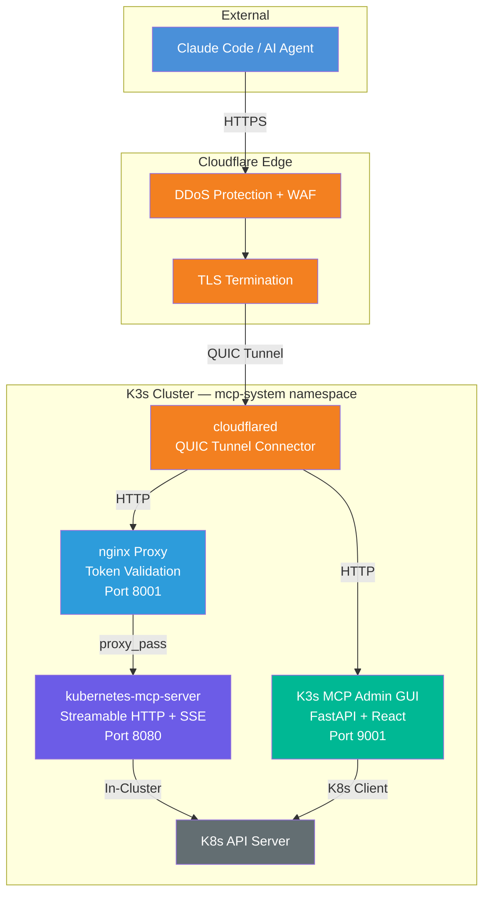
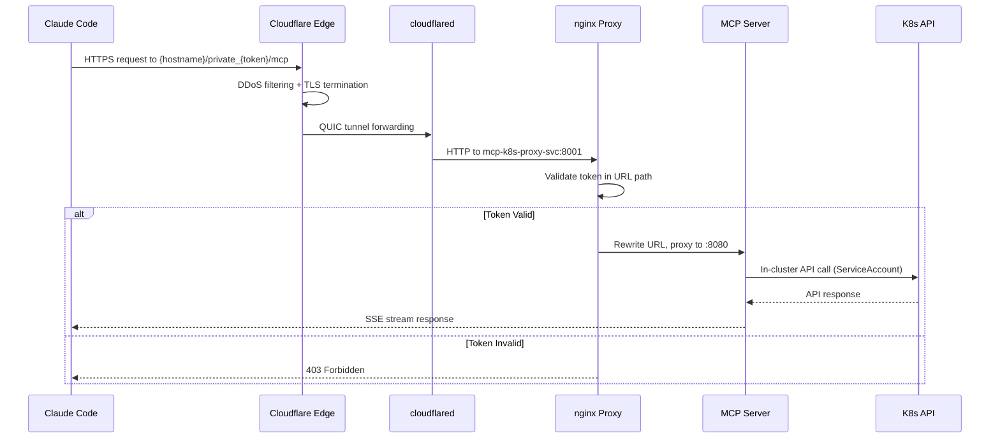
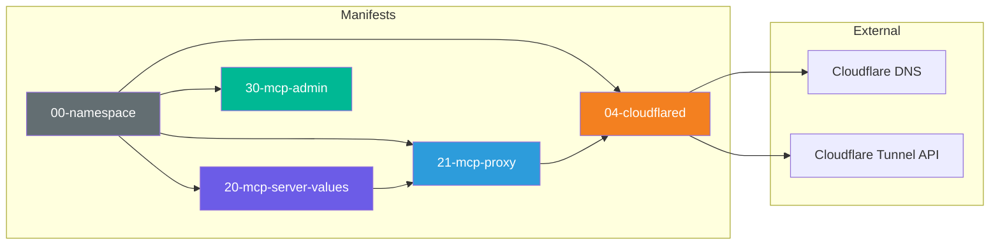

<p align="center">
  
</p>

<h1 align="center">WOOWTECH K3s MCP Server</h1>

<p align="center">
  <strong>AI-Powered Kubernetes Cluster Management via Model Context Protocol</strong><br/>
  Let Claude, GPT, and other LLMs manage your K3s/K8s clusters through a standardized MCP interface
</p>

<p align="center">
  <a href="README.zh-TW.md">中文文件</a> &bull;
  <a href="#architecture">Architecture</a> &bull;
  <a href="#features">Features</a> &bull;
  <a href="#quick-start">Quick Start</a> &bull;
  <a href="#screenshots">Screenshots</a>
</p>

<p align="center">
  
  
  
  
  
  
  
</p>

---

## Overview

| Challenge | Solution |
|-----------|----------|
| K8s CLI is complex and error-prone | LLM understands natural language and translates to precise K8s operations |
| kubectl requires memorizing 100+ commands | 23 MCP tools covering pods, resources, Helm, and cluster management |
| No visibility into cluster state during AI conversations | Real-time Admin GUI with dashboard, tool management, and log viewer |
| Exposing K8s API to the internet is dangerous | Cloudflare Tunnel + token-authenticated proxy with zero exposed ports |
| Managing MCP tokens and access is manual | Admin GUI with one-click token rotation and history tracking |

<p align="center">
  
</p>

---

## Architecture

### System Overview

```
                    ┌──────────────────────────────────────────────────────┐
                    │                   EXTERNAL                           │
                    │                                                      │
                    │  Claude Code / AI Agent                              │
                    │  URL: https://{hostname}/private_{token}/mcp         │
                    └──────────────────────┬───────────────────────────────┘
                                           │ HTTPS (TLS 1.3)
                                           ▼
                    ┌──────────────────────────────────────────────────────┐
                    │              Cloudflare Edge Network                  │
                    │  ┌────────────┐  ┌──────────┐  ┌─────────────────┐  │
                    │  │ DDoS Prot. │  │ WAF/TLS  │  │ CNAME Routing   │  │
                    │  └────────────┘  └──────────┘  └─────────────────┘  │
                    └──────────────────────┬───────────────────────────────┘
                                           │ QUIC Tunnel (encrypted)
                                           ▼
┌─────────────────────────────────────────────────────────────────────────────┐
│                    K3s Cluster (mcp-system namespace)                        │
│                                                                             │
│  ┌─────────────┐     ┌──────────────────┐     ┌────────────────────────┐  │
│  │ cloudflared │────▶│  nginx Proxy     │────▶│ kubernetes-mcp-server  │  │
│  │             │     │  (Token Auth)     │     │  (Streamable HTTP)     │  │
│  │  Port: N/A  │     │  Port: 8001      │     │  Port: 8080            │  │
│  └─────────────┘     └──────────────────┘     └────────────┬───────────┘  │
│                                                             │              │
│  ┌──────────────────────────┐                              ▼              │
│  │  K3s MCP Admin GUI       │                    ┌──────────────────┐     │
│  │  (FastAPI + React)       │                    │  K8s API Server  │     │
│  │  Port: 9001              │                    │  (cluster-admin) │     │
│  │  JWT Authentication      │                    └──────────────────┘     │
│  └──────────────────────────┘                                             │
│                                                                             │
└─────────────────────────────────────────────────────────────────────────────┘
```

### Mermaid Diagram



### Authentication Flow



### Component Dependency



---

## Features

### MCP Server -- 23 Tools in 3 Categories

| Category | Tools | Description |
|----------|-------|-------------|
| **Core** (13 tools) | `pods_list`, `pods_get`, `pods_log`, `pods_exec`, `pods_top`, `pods_run`, `pods_delete`, `namespaces_list`, `events_list`, `nodes_log`, `nodes_top`, `nodes_stats_summary` | Pod lifecycle, node monitoring, namespace/event queries |
| **Config** (6 tools) | `resources_list`, `resources_get`, `resources_create_or_update`, `resources_delete`, `resources_scale`, `configuration_view` | CRUD any K8s resource, scale deployments, view MCP config |
| **Helm** (4 tools) | `helm_list`, `helm_install`, `helm_uninstall`, `projects_list` | Full Helm release lifecycle management |

**Dangerous tools** (require `confirmation_fallback: "allow"`): `pods_exec`, `pods_run`, `pods_delete`, `resources_create_or_update`, `resources_delete`, `resources_scale`, `helm_install`, `helm_uninstall`

### Admin GUI -- 7 Pages

- **Dashboard** -- Overall health status of MCP server, proxy, and admin components
- **Cluster Overview** -- Node count, namespace count, pod count at a glance
- **Tool Manager** -- View all 23 MCP tools, categorized with danger indicators
- **Token Manager** -- View, rotate, and track MCP authentication token history
- **Settings** -- MCP server pod status, restart controls, configuration
- **Log Viewer** -- Real-time streaming logs from MCP server pods
- **Login** -- JWT-based authentication (HS256, 24-hour expiry)

### Security

- **Zero exposed ports** -- Cloudflare Tunnel handles all ingress (no LoadBalancer, no NodePort)
- **Token authentication** -- 32-character hex token in URL path, rotatable via Admin GUI
- **JWT authentication** -- Admin GUI protected by HS256 JWT with configurable expiry
- **RBAC** -- ServiceAccount with configurable ClusterRole binding
- **Network isolation** -- All services are ClusterIP, accessible only within the cluster

### Deployment

- **Helm-based** -- kubernetes-mcp-server deployed via official Helm chart
- **4 manifests** -- Complete deployment in 4 YAML files
- **Cloudflare Tunnel** -- Auto-initialization script for tunnel setup
- **Ephemeral registry** -- ttl.sh support for environments without private registry access

---

## Quick Start

### Prerequisites

- K3s/K8s cluster (v1.28+)
- Helm 3.x
- `kubectl` configured with cluster access
- Cloudflare account with a domain (for external access)
- Claude Code or any MCP-compatible client

### Step 1: Create Namespace

```bash
kubectl create namespace mcp-system
```

### Step 2: Deploy MCP Server (Helm)

```bash
helm upgrade -i kubernetes-mcp-server \
  oci://ghcr.io/containers/charts/kubernetes-mcp-server \
  -n mcp-system \
  -f k8s-manifests/20-mcp-server-values.yaml
```

### Step 3: Deploy Proxy + Admin GUI

```bash
kubectl apply -f k8s-manifests/21-mcp-proxy.yaml
kubectl apply -f k8s-manifests/30-mcp-admin.yaml
```

### Step 4: Setup Cloudflare Tunnel

```bash
# Initialize tunnel
export CF_API_TOKEN="your-cloudflare-api-token"
export TUNNEL_NAME="your-tunnel-name"
export OPENCLAW_DOMAIN="your-domain.com"
python3 init-cloudflare.py

# Create K8s secret with tunnel token
kubectl -n mcp-system create secret generic cf-secrets \
  --from-literal=CF_TUNNEL_TOKEN="<token-from-output>"

# Deploy cloudflared
kubectl apply -f k8s-manifests/04-cloudflared.yaml
```

### Step 5: Configure Claude Code

Add to `~/.claude/settings.json`:

```json
{
  "mcpServers": {
    "kubernetes": {
      "type": "url",
      "url": "https://your-k8s-mcp.example.com/private_{your_token}/mcp"
    }
  }
}
```

### Step 6: Verify

```bash
# Check all pods are running
kubectl -n mcp-system get pods

# Test MCP endpoint
curl -s "https://your-k8s-mcp.example.com/private_{token}/mcp" \
  -X POST -H "Content-Type: application/json" \
  -H "Accept: application/json, text/event-stream" \
  -d '{"jsonrpc":"2.0","id":1,"method":"initialize","params":{
    "protocolVersion":"2025-03-26",
    "capabilities":{},
    "clientInfo":{"name":"test","version":"1.0"}
  }}'
```

---

## Configuration

### MCP Server (Helm Values)

| Parameter | Default | Description |
|-----------|---------|-------------|
| `config.port` | `"8080"` | MCP server listen port |
| `config.log_level` | `2` | Log verbosity (0-5) |
| `config.confirmation_fallback` | `"allow"` | Behavior for dangerous tools when client lacks elicitation |
| `config.toolsets` | `[core, config, helm]` | Enabled tool categories |
| `rbac.extraClusterRoleBindings[0].roleRef.name` | `cluster-admin` | RBAC role (use custom role in production) |
| `service.type` | `ClusterIP` | Service type |
| `ingress.enabled` | `false` | Ingress disabled (uses Cloudflare Tunnel) |

### Proxy (nginx)

| Parameter | Location | Description |
|-----------|----------|-------------|
| Token path | `21-mcp-proxy.yaml` ConfigMap | `/private_{32-char-hex}/` -- URL path for authentication |
| Upstream | ConfigMap | `http://kubernetes-mcp-server:8080` |
| Timeout | ConfigMap | `86400s` (24 hours) for long-running MCP streams |
| Buffering | ConfigMap | Disabled (`proxy_buffering off`) for SSE streaming |

### Admin GUI

| Environment Variable | Default | Description |
|---------------------|---------|-------------|
| `NAMESPACE` | `mcp-system` | Kubernetes namespace to monitor |
| `JWT_SECRET` | Auto-generated | Secret for JWT signing |
| `JWT_EXPIRY_HOURS` | `24` | JWT token expiry in hours |
| `MCP_EXTERNAL_URL` | Required | Public URL of the MCP endpoint |

---

## Project Structure

```
Woow_k3s_mcp_server/
├── README.md                        # English documentation
├── README.zh-TW.md                  # Traditional Chinese documentation
├── PLAN.md                          # Deployment strategy document
├── init-cloudflare.py               # Cloudflare Tunnel auto-initialization
├── .env.example                     # Environment variable template
├── .gitignore
│
├── k8s-manifests/                   # Kubernetes deployment manifests
│   ├── 20-mcp-server-values.yaml    #   Helm values for MCP server
│   ├── 21-mcp-proxy.yaml           #   nginx proxy + token auth
│   ├── 30-mcp-admin.yaml           #   Admin GUI deployment
│   └── 04-cloudflared.yaml         #   Cloudflare Tunnel connector
│
├── k3s-mcp-admin/                   # Admin GUI application
│   ├── Dockerfile                   #   Multi-stage build (Node + Python)
│   ├── frontend/                    #   React 19 + Vite + Tailwind CSS 4
│   │   ├── src/
│   │   │   ├── pages/               #     7 pages (Dashboard, Cluster, Tools, ...)
│   │   │   ├── components/          #     Shared components (Sidebar, StatusCard)
│   │   │   └── api.js               #     API client
│   │   └── package.json
│   ├── k3s_mcp_admin/               #   FastAPI backend (K3s-specific)
│   │   ├── main.py                  #     App factory + router registration
│   │   ├── k8s_manager.py          #     Kubernetes client wrapper
│   │   ├── tool_registry.py        #     MCP tool registry
│   │   └── routers/                 #     API routers (health, cluster, tools, ...)
│   └── mcp-admin-core/              #   Shared core library
│       └── mcp_admin_core/
│           ├── app.py               #     FastAPI app factory
│           ├── proxy.py             #     HTTP/SSE proxy to MCP server
│           ├── auth/                #     JWT middleware
│           ├── config/              #     Persistent config store
│           └── k8s/                 #     Kubernetes client library
│
├── tests/                           # Test suites
│   └── mcp-server/                  #   Enterprise test suite (119 tests, 10 rounds)
│       ├── run-all.sh               #     Master test runner
│       ├── round1-infra.sh ~ round10-e2e.sh
│       └── playwright/              #     Browser-based endpoint tests
│
└── docs/                            # Documentation
    └── screenshots/                 #   Application screenshots
```

---

## Screenshots

### Login Page

Secure JWT-based authentication with password input.

<p align="center">
  
</p>

### Dashboard

Real-time health monitoring of all MCP components -- server, proxy, and admin GUI.

<p align="center">
  
</p>

### Cluster Overview

At-a-glance view of cluster resources -- nodes, namespaces, and running pods.

<p align="center">
  
</p>

### Tool Manager

Browse all 23 MCP tools organized by category (Core, Config, Helm) with danger indicators.

<p align="center">
  
</p>

### Token Manager

One-click MCP authentication token rotation with full history tracking.

<p align="center">
  
</p>

### Settings

MCP server pod status, container details, restart controls, and endpoint configuration.

<p align="center">
  
</p>

### Log Viewer

Real-time streaming log viewer for MCP server pods with container selection.

<p align="center">
  
</p>

---

## MCP Protocol

This project uses the **MCP 2025-03-26** specification with Streamable HTTP transport.

### Endpoint

```
POST /mcp
Content-Type: application/json
Accept: application/json, text/event-stream
```

### Initialize

```json
{
  "jsonrpc": "2.0",
  "id": 1,
  "method": "initialize",
  "params": {
    "protocolVersion": "2025-03-26",
    "capabilities": {},
    "clientInfo": { "name": "my-client", "version": "1.0" }
  }
}
```

### Response (SSE)

```
event: message
data: {"jsonrpc":"2.0","id":1,"result":{
  "capabilities":{"logging":{},"prompts":{"listChanged":true},
    "resources":{"listChanged":true},"tools":{"listChanged":true}},
  "protocolVersion":"2025-03-26",
  "serverInfo":{"name":"kubernetes-mcp-server",
    "title":"kubernetes-mcp-server"}
}}
```

### Tool Invocation Example

```json
{
  "jsonrpc": "2.0",
  "id": 2,
  "method": "tools/call",
  "params": {
    "name": "pods_list",
    "arguments": { "namespace": "mcp-system" }
  }
}
```

---

## Testing

### Enterprise Test Suite

119 tests across 10 rounds covering infrastructure, protocol, security, and performance:

| Round | Category | Tests | Description |
|-------|----------|-------|-------------|
| 1 | Infrastructure | 12 | Pod readiness, service endpoints, DNS resolution |
| 2 | Protocol | 15 | MCP initialization, streaming, JSON-RPC compliance |
| 3 | Proxy | 12 | Token validation, path rewriting, timeout behavior |
| 4 | Core Tools | 18 | Pod CRUD, namespace operations, node monitoring |
| 5 | Extra Tools | 15 | Resource management, Helm operations, scaling |
| 6 | Security | 12 | Auth bypass attempts, RBAC validation, token rotation |
| 7 | Performance | 10 | Latency benchmarks, concurrent connections, streaming |
| 8 | Resilience | 10 | Pod restart recovery, tunnel reconnection, proxy failover |
| 9 | Edge Cases | 8 | Large payloads, special characters, malformed requests |
| 10 | End-to-End | 7 | Full workflow: deploy, verify, cleanup via MCP tools |

```bash
# Run all tests
cd tests/mcp-server && bash run-all.sh

# Run specific round
bash round4-tools-core.sh
```

---

## Deployment Architecture for Multiple Clusters

Each cluster gets its own independent MCP stack. No architectural changes needed -- just repeat the same deployment:

```
Cluster A (Dev)                          Cluster B (Prod)
├── kubernetes-mcp-server                ├── kubernetes-mcp-server
├── nginx proxy (token_A)                ├── nginx proxy (token_B)
├── cloudflared                          ├── cloudflared
├── admin GUI                            ├── admin GUI
│                                        │
└── k8s-dev-mcp.example.com             └── k8s-prod-mcp.example.com
         ↑                                        ↑
         └──── Claude Code settings.json ──────────┘
               mcpServers:
                 k8s_dev:  url: .../private_{tok_A}/mcp
                 k8s_prod: url: .../private_{tok_B}/mcp
```

---

## Tech Stack

| Component | Technology | Version |
|-----------|------------|---------|
| MCP Server | [kubernetes-mcp-server](https://github.com/containers/kubernetes-mcp-server) | v0.0.65 |
| MCP Protocol | Streamable HTTP + SSE | 2025-03-26 |
| Admin Frontend | React + Vite + Tailwind CSS | 19 / 6 / 4 |
| Admin Backend | FastAPI + Uvicorn | Python 3.12 |
| K8s Client | kubernetes (Python) | 28.0+ |
| Proxy | nginx:alpine | Latest |
| Tunnel | Cloudflare Tunnel (cloudflared) | Latest |
| Orchestration | Helm 3 | 3.x |
| Container Runtime | K3s (containerd) | v1.33 |

---

## Support

- **Email**: woowtech@designsmart.com.tw
- **Issues**: [GitHub Issues](https://github.com/WOOWTECH/Woow_k3s_mcp_server/issues)

---

## License

This project is proprietary software by WOOWTECH. All rights reserved.

---

<p align="center">
  <sub>Built with care by <a href="https://github.com/WOOWTECH">WOOWTECH</a></sub>
</p>
