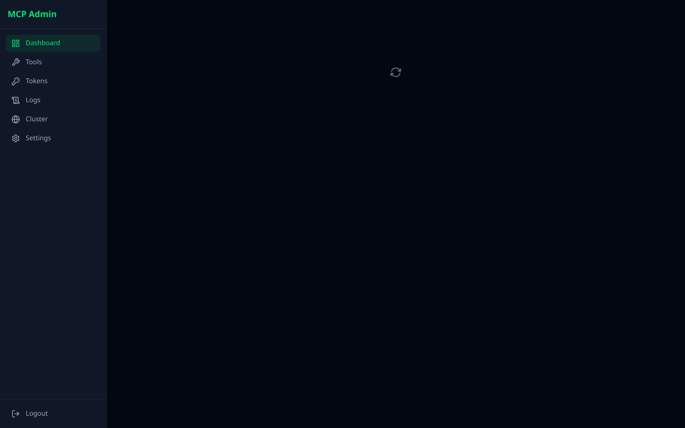
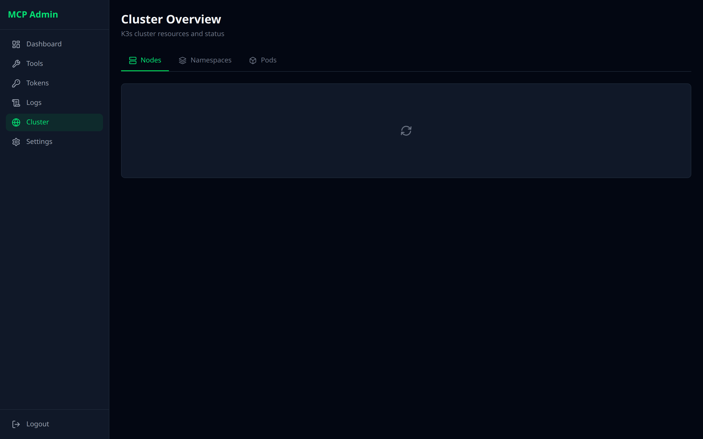
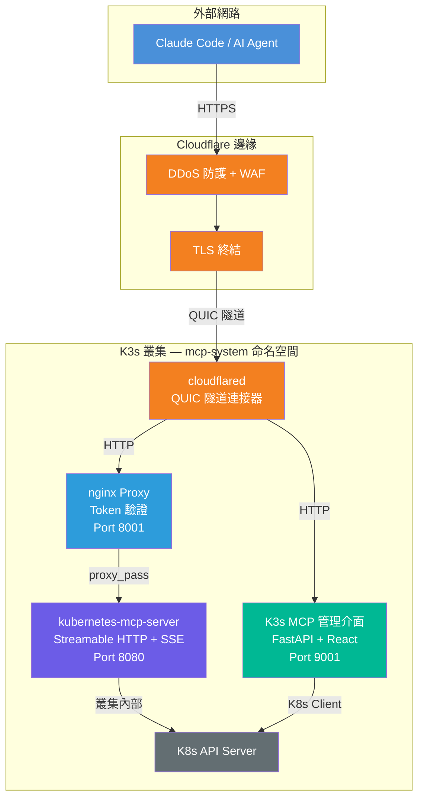
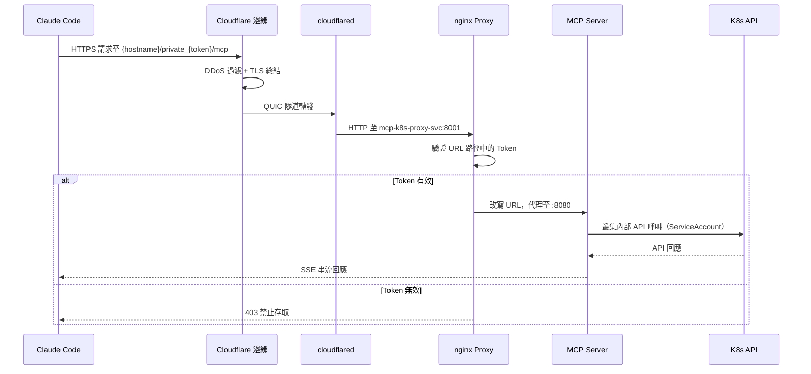
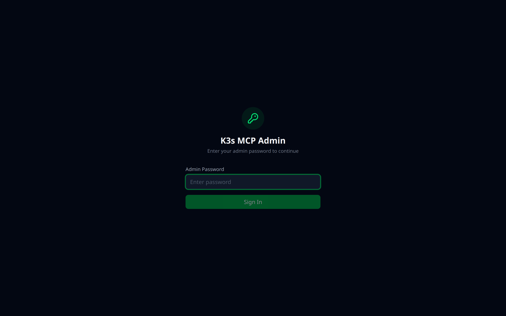
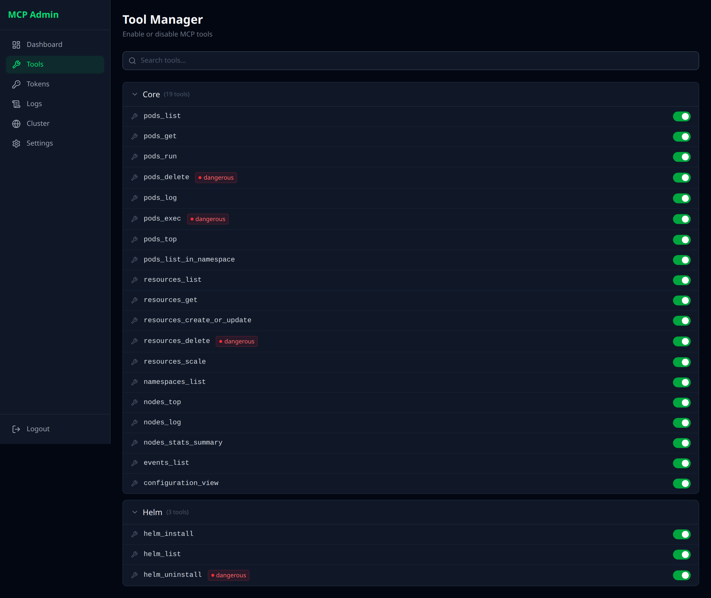
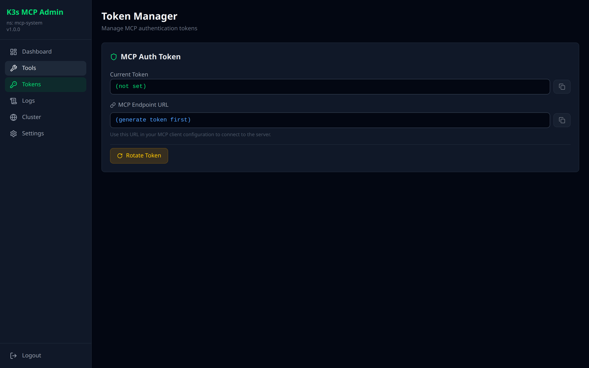
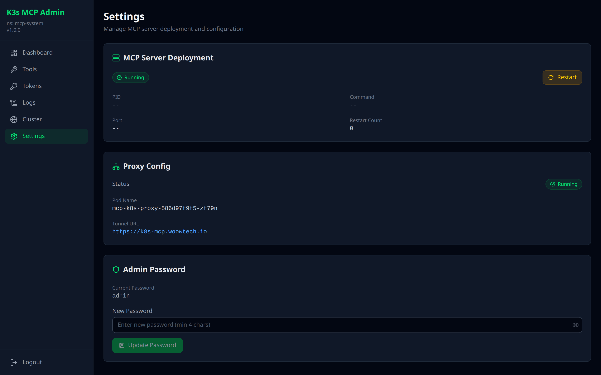
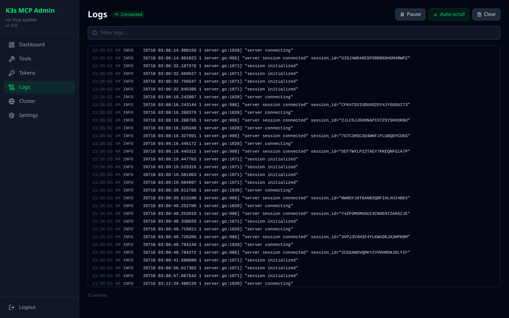

<p align="center">
  
</p>

<h1 align="center">WOOWTECH K3s MCP Server</h1>

<p align="center">
  <strong>透過 Model Context Protocol 實現 AI 驅動的 Kubernetes 叢集管理</strong><br/>
  讓 Claude、GPT 等大型語言模型透過標準化 MCP 介面管理您的 K3s/K8s 叢集
</p>

<p align="center">
  <a href="README.md">English</a> &bull;
  <a href="#架構">架構</a> &bull;
  <a href="#功能特色">功能特色</a> &bull;
  <a href="#快速開始">快速開始</a> &bull;
  <a href="#畫面截圖">畫面截圖</a>
</p>

<p align="center">
  
  
  
  
  
  
  
</p>

---

## 概述

| 挑戰 | 解決方案 |
|------|----------|
| K8s CLI 複雜且容易出錯 | LLM 理解自然語言並轉換為精確的 K8s 操作 |
| kubectl 需要記住 100+ 指令 | 23 個 MCP 工具涵蓋 Pod、資源、Helm 和叢集管理 |
| AI 對話中無法即時看到叢集狀態 | 即時管理介面，含儀表板、工具管理和日誌檢視器 |
| 將 K8s API 暴露到網際網路很危險 | Cloudflare Tunnel + Token 認證代理，零端口暴露 |
| 管理 MCP Token 和存取權限是手動的 | 管理介面支援一鍵 Token 輪換與歷史追蹤 |

<p align="center">
  
</p>

---

## 架構

### 系統總覽

```
                    ┌──────────────────────────────────────────────────────┐
                    │                     外部網路                          │
                    │                                                      │
                    │  Claude Code / AI Agent                              │
                    │  URL: https://{hostname}/private_{token}/mcp         │
                    └──────────────────────┬───────────────────────────────┘
                                           │ HTTPS (TLS 1.3)
                                           ▼
                    ┌──────────────────────────────────────────────────────┐
                    │              Cloudflare 邊緣網路                      │
                    │  ┌────────────┐  ┌──────────┐  ┌─────────────────┐  │
                    │  │ DDoS 防護  │  │ WAF/TLS  │  │ CNAME 路由      │  │
                    │  └────────────┘  └──────────┘  └─────────────────┘  │
                    └──────────────────────┬───────────────────────────────┘
                                           │ QUIC Tunnel（加密隧道）
                                           ▼
┌─────────────────────────────────────────────────────────────────────────────┐
│                    K3s 叢集（mcp-system 命名空間）                           │
│                                                                             │
│  ┌─────────────┐     ┌──────────────────┐     ┌────────────────────────┐  │
│  │ cloudflared │────▶│  nginx Proxy     │────▶│ kubernetes-mcp-server  │  │
│  │             │     │  （Token 驗證）    │     │  （Streamable HTTP）    │  │
│  │  Port: N/A  │     │  Port: 8001      │     │  Port: 8080            │  │
│  └─────────────┘     └──────────────────┘     └────────────┬───────────┘  │
│                                                             │              │
│  ┌──────────────────────────┐                              ▼              │
│  │  K3s MCP 管理介面         │                    ┌──────────────────┐     │
│  │  （FastAPI + React）      │                    │  K8s API Server  │     │
│  │  Port: 9001              │                    │  （cluster-admin）│     │
│  │  JWT 認證                │                    └──────────────────┘     │
│  └──────────────────────────┘                                             │
│                                                                             │
└─────────────────────────────────────────────────────────────────────────────┘
```

### Mermaid 圖表



### 認證流程



---

## 功能特色

### MCP Server -- 23 個工具，3 大類別

| 類別 | 工具 | 說明 |
|------|------|------|
| **Core**（13 個） | `pods_list`, `pods_get`, `pods_log`, `pods_exec`, `pods_top`, `pods_run`, `pods_delete`, `namespaces_list`, `events_list`, `nodes_log`, `nodes_top`, `nodes_stats_summary` | Pod 生命週期、節點監控、命名空間/事件查詢 |
| **Config**（6 個） | `resources_list`, `resources_get`, `resources_create_or_update`, `resources_delete`, `resources_scale`, `configuration_view` | K8s 資源 CRUD、部署擴縮、MCP 設定檢視 |
| **Helm**（4 個） | `helm_list`, `helm_install`, `helm_uninstall`, `projects_list` | 完整的 Helm Release 生命週期管理 |

**危險工具**（需設定 `confirmation_fallback: "allow"`）：`pods_exec`、`pods_run`、`pods_delete`、`resources_create_or_update`、`resources_delete`、`resources_scale`、`helm_install`、`helm_uninstall`

### 管理介面 -- 7 個頁面

- **儀表板** -- MCP Server、Proxy、Admin 元件的即時健康狀態監控
- **叢集概覽** -- 節點數、命名空間數、運行中 Pod 數一目瞭然
- **工具管理** -- 瀏覽全部 23 個 MCP 工具，按類別分組並標示危險等級
- **Token 管理** -- 一鍵輪換 MCP 認證 Token，完整歷史追蹤
- **設定** -- MCP Server Pod 狀態、容器詳情、重啟控制、端點設定
- **日誌檢視器** -- MCP Server Pod 的即時串流日誌檢視
- **登入** -- JWT 認證（HS256，24 小時過期）

### 安全性

- **零端口暴露** -- Cloudflare Tunnel 處理所有入站流量（無 LoadBalancer、無 NodePort）
- **Token 認證** -- URL 路徑中的 32 字元 hex Token，可透過管理介面輪換
- **JWT 認證** -- 管理介面受 HS256 JWT 保護，可設定過期時間
- **RBAC** -- ServiceAccount 綁定可設定的 ClusterRole
- **網路隔離** -- 所有服務皆為 ClusterIP，僅叢集內部可存取

### 部署方式

- **Helm 部署** -- kubernetes-mcp-server 透過官方 Helm chart 部署
- **4 個 manifest** -- 4 個 YAML 檔案即完成完整部署
- **Cloudflare Tunnel** -- 自動化初始化腳本設定隧道
- **臨時 Registry** -- 支援 ttl.sh，適用於無私有 Registry 的環境

---

## 快速開始

本專案是一個放在 repo 根目錄的單一 Helm chart，涵蓋後端全部 3 個元件：上游
`kubernetes-mcp-server`（chart dependency）、有 token 認證的 nginx proxy，以及
管理介面。舊的 `k8s-manifests/*.yaml` 僅保留作參考／歷史紀錄 -- 請用下方的
chart 安裝，不要直接 `kubectl apply` 那些檔案。

### 前置條件

- K3s/K8s 叢集（v1.28+）
- Helm 3.19+
- 已設定 `kubectl` 叢集存取權限
- Cloudflare 帳號及網域（外部存取用）-- **這個 chart 本身永遠不會啟動
  tunnel**，請自行在 proxy Service 前面接上你自己的 cloudflared/ingress
- Claude Code 或任何相容 MCP 的用戶端

### A. 直接從 repo tarball 安裝（免 clone）

```bash
TOKEN=$(python3 -c "import secrets; print(secrets.token_hex(16))")

helm upgrade --install mcp-helm \
  https://github.com/WOOWTECH/Woow_k3s_mcp_server/archive/refs/heads/main.tar.gz \
  --create-namespace -n mcp-helm \
  --set proxy.token="$TOKEN" \
  --set secrets.create=true \
  --set secrets.jwtSecret="$(python3 -c 'import secrets; print(secrets.token_hex(32))')"
```

### B. 或先 clone 到本機（可以先檢查/固定 dependency 版本）

```bash
git clone https://github.com/WOOWTECH/Woow_k3s_mcp_server.git
cd Woow_k3s_mcp_server
helm dependency build .   # 抓取 oci://ghcr.io/containers/charts/kubernetes-mcp-server

kubectl create namespace mcp-helm
# 建議在 Helm 之外自行管理 admin 的 JWT secret（跟舊 manifests 的做法一致）：
# 參考 examples/secrets.example.yaml，然後：
#   kubectl -n mcp-helm apply -f /secure/path/secrets.yaml
# 或是想快速／測試安裝，讓 chart 自己產生：
#   --set secrets.create=true --set secrets.jwtSecret=...

helm upgrade --install mcp-helm . -n mcp-helm \
  --set proxy.token="$(python3 -c 'import secrets; print(secrets.token_hex(16))')"
```

`proxy.token` 在這個 chart 裡**沒有任何預設值** -- 沒給值 Helm 會直接拒絕
render，所以真實或佔位用的 token 都不可能不小心被打包進去。它也不是
Kubernetes Secret（nginx 是直接在 URL 路徑裡比對它，所以一定得烤進實際送出的
`nginx.conf`）：不要把它放進任何會 commit 的 values 檔，改用 `--set` 或放在
repo 外的 values 檔。

### 驗證

```bash
kubectl -n mcp-helm rollout status deploy/mcp-helm-kubernetes-mcp-server --timeout=5m
kubectl -n mcp-helm rollout status deploy/mcp-k8s-proxy --timeout=5m
helm test mcp-helm -n mcp-helm
```

`helm test` 會走真實的用戶端路徑（nginx token proxy -> MCP server）：健康檢查、
一次完整的 `initialize` + `tools/list` JSON-RPC 往返，並確認錯誤 token 會被
擋 403。

### 解除安裝（保留資料）

```bash
helm uninstall mcp-helm -n mcp-helm
```

`keepOnUninstall: true`（預設）會在管理介面的 PVC，以及 `secrets.create=true`
時 render 出來的 JWT Secret 上加上 `helm.sh/resource-policy: keep`，所以
`helm uninstall` 永遠不會刪掉它們。確定不再需要那些資料後，再自行刪除：

```bash
kubectl delete pvc -n mcp-helm k3s-mcp-admin-data
kubectl delete namespace mcp-helm
```

### 從 k8s-manifests／舊版 `mcp-system` 安裝遷移

`kubectl apply -f k8s-manifests/*.yaml` 描述的是另一套獨立管理的舊安裝
（release `kubernetes-mcp-server` + 手動 apply 的 proxy/admin manifests，在
`mcp-system` namespace）。這個 chart 是**平行、獨立**的安裝，用自己的
namespace／release 名稱（`mcp-helm`），不是接管：

- 叢集層級的 RBAC 名稱刻意採用 release 衍生命名
  （`mcp-helm-k3s-mcp-admin-role`／`-binding`、
  `mcp-helm-kubernetes-mcp-server-mcp-full-access`），所以永遠不會跟舊 release
  的 `k3s-mcp-admin-role`／`-binding` 及
  `kubernetes-mcp-server-mcp-full-access` 撞名。
- 把 Cloudflare Tunnel／用戶端設定指向你要保留服務的那一套安裝的 proxy
  Service，再把另一套的 Deployment 縮到 0（在還需要它的資料／RBAC 之前不要
  直接刪除）。
- 把舊 manifests 真正 `helm upgrade --install --take-ownership` 進這個 chart
  不在本階段範圍內 -- 舊安裝是用原生 `kubectl apply` 管理，不是 Helm，維持
  原樣不動。

### 已知限制：管理介面映像檔的私有 registry 目前連不上

管理介面的映像檔（`admin.image.repository`，預設
`192.168.2.253:5050/k3s-mcp-admin`，由 `k3s-mcp-admin/Dockerfile` build 出來）
放在 WOOWTECH 內部 LAN 的私有 registry -- 這是目前實際在用的 build 路徑，取代
更早、已經過期的 `ttl.sh` 映像檔。這次在 LOCAL 叢集驗證這個 chart 時，該
registry 主機連不上（"no route to host"）；`deploy/local/mcp-helm.yaml` 因此
先設 `admin.enabled=false`，等該 registry（或替代方案）恢復可連線再打開。
管理介面的 chart、RBAC、template 都已備妥並通過 `kubeconform` 驗證，只是這次
沒能實際驗證 image pull；registry 恢復後用 `--set admin.enabled=true`
重新啟用即可，或是先把映像檔推到你目前連得到的 registry。

### Cloudflare Tunnel（自備，這個 chart 不會啟動它）

請把你自己管理的 tunnel／ingress 指向 release namespace 底下的
`mcp-k8s-proxy-svc:8001`。`k8s-manifests/04-cloudflared.yaml` 只是示範
cloudflared Deployment 的樣子作為參考，這個 chart 不會 render 或管理它 --
千萬不要在這裡帶入真的 tunnel token 去啟動連接器。

```bash
# 初始化隧道（你自己的工具／init-cloudflare.py）
export CF_API_TOKEN="your-cloudflare-api-token"
export TUNNEL_NAME="your-tunnel-name"
export OPENCLAW_DOMAIN="your-domain.com"
python3 init-cloudflare.py

# 自行在你自己的 manifest/chart 裡建立存放隧道 Token 的 K8s Secret
kubectl -n mcp-helm create secret generic cf-secrets \
  --from-literal=CF_TUNNEL_TOKEN="<上述輸出的 token>"
```

### 設定 Claude Code

新增至 `~/.claude/settings.json`，token 就用你傳給 `proxy.token` 的那個值：

```json
{
  "mcpServers": {
    "kubernetes": {
      "type": "url",
      "url": "https://your-k8s-mcp.example.com/private_{your_token}/mcp"
    }
  }
}
```

---

## 設定

以下全部都是 chart values（`values.yaml`）；用 `--set` 或自己的
`-f values-override.yaml` 傳入即可。這裡任何一項都不該被 commit 進真的機密值
-- 參考 [`examples/secrets.example.yaml`](examples/secrets.example.yaml)。

| Value | 預設值 | 說明 |
|-------|--------|------|
| `namespace.name` | `mcp-helm` | Release 的 namespace（若等於 `--namespace` 則不 render） |
| `keepOnUninstall` | `true` | 在管理介面 PVC、JWT Secret 上加 `helm.sh/resource-policy: keep` |
| `storageClassName` | `local-path` | 管理介面 PVC 的預設 StorageClass |
| `secrets.create` | `false` | `true` 時會從 `secrets.jwtSecret` render 出 `k3s-mcp-admin-secrets` |
| `secrets.jwtSecret` | `""` | 管理介面 JWT 簽章金鑰（只有 `secrets.create=true` 才會用到） |
| `kubernetes-mcp-server.*` | 對應 `k8s-manifests/20-mcp-server-values.yaml` | 直接傳給上游 chart dependency 的值 |
| `proxy.token` | **無 -- 必填** | `/private_<token>/` 那段路徑；不是 Secret，會被烤進 `nginx.conf` |
| `admin.enabled` | `true` | 管理介面映像檔拉不下來時設 `false`（見上方「已知限制」） |
| `admin.image.repository` / `.tag` | `192.168.2.253:5050/k3s-mcp-admin` / `latest` | 目前的 build 路徑 -- 由 `k3s-mcp-admin/Dockerfile` build 出來 |
| `admin.externalUrl` | `https://k8s-mcp.woowtech.io` | 管理介面顯示的公開 URL（僅供顯示） |
| `tests.enabled` | `true` | 是否 render `helm test` smoke pod |

### Proxy（nginx）-- render 出來的 ConfigMap 樣貌

| 參數 | 來源 | 說明 |
|------|------|------|
| Token 路徑 | `proxy.token` | `/private_{32字元hex}/` -- URL 路徑認證 |
| 上游 | （自動計算） | `http://<release>-kubernetes-mcp-server:<kubernetes-mcp-server.service.port>` |
| 逾時 | 固定值 | `86400s`（24 小時），支援長時間 MCP 串流 |
| 緩衝 | 固定值 | 停用（`proxy_buffering off`），支援 SSE 串流 |

### 管理介面

| 環境變數 | 來源 | 說明 |
|----------|------|------|
| `NAMESPACE` | release namespace | 監控的 Kubernetes 命名空間 |
| `JWT_SECRET` | Secret `k3s-mcp-admin-secrets` 的 `jwt-secret` 欄位 | JWT 簽章金鑰 |
| `MCP_EXTERNAL_URL` | `admin.externalUrl` | MCP 端點的公開 URL |

---

## 專案結構

```
Woow_k3s_mcp_server/
├── README.md                        # 英文文件
├── README.zh-TW.md                  # 繁體中文文件
├── PLAN.md                          # 部署策略文件
├── init-cloudflare.py               # Cloudflare Tunnel 自動初始化
├── .env.example                     # 環境變數範本
├── .gitignore
│
├── k8s-manifests/                   # Kubernetes 部署 manifest
│   ├── 20-mcp-server-values.yaml    #   MCP Server 的 Helm values
│   ├── 21-mcp-proxy.yaml           #   nginx proxy + Token 認證
│   ├── 30-mcp-admin.yaml           #   管理介面部署
│   └── 04-cloudflared.yaml         #   Cloudflare Tunnel 連接器
│
├── k3s-mcp-admin/                   # 管理介面應用程式
│   ├── Dockerfile                   #   多階段建構（Node + Python）
│   ├── frontend/                    #   React 19 + Vite + Tailwind CSS 4
│   │   ├── src/
│   │   │   ├── pages/               #     7 個頁面
│   │   │   ├── components/          #     共用元件
│   │   │   └── api.js               #     API 用戶端
│   │   └── package.json
│   ├── k3s_mcp_admin/               #   FastAPI 後端（K3s 專用）
│   │   ├── main.py                  #     App factory + 路由註冊
│   │   ├── k8s_manager.py          #     Kubernetes 用戶端封裝
│   │   ├── tool_registry.py        #     MCP 工具註冊表
│   │   └── routers/                 #     API 路由（health, cluster, tools, ...）
│   └── mcp-admin-core/              #   共用核心函式庫
│       └── mcp_admin_core/
│           ├── app.py               #     FastAPI app factory
│           ├── proxy.py             #     HTTP/SSE 代理至 MCP Server
│           ├── auth/                #     JWT 中介層
│           ├── config/              #     持久化設定存儲
│           └── k8s/                 #     Kubernetes 用戶端函式庫
│
├── tests/                           # 測試套件
│   └── mcp-server/                  #   企業級測試套件（119 測試，10 輪）
│       ├── run-all.sh               #     主測試執行器
│       ├── round1-infra.sh ~ round10-e2e.sh
│       └── playwright/              #     瀏覽器端點測試
│
└── docs/                            # 文件
    └── screenshots/                 #   應用程式截圖
```

---

## 畫面截圖

### 登入頁面

安全的 JWT 認證，密碼輸入介面。

<p align="center">
  
</p>

### 儀表板

即時監控所有 MCP 元件的健康狀態 -- Server、Proxy 和 Admin。

<p align="center">
  
</p>

### 叢集概覽

叢集資源一覽 -- 節點數、命名空間數、運行中的 Pod 數量。

<p align="center">
  
</p>

### 工具管理

瀏覽全部 23 個 MCP 工具，按類別分組（Core、Config、Helm），標示危險等級。

<p align="center">
  
</p>

### Token 管理

一鍵輪換 MCP 認證 Token，完整的歷史追蹤記錄。

<p align="center">
  
</p>

### 設定

MCP Server Pod 狀態、容器詳情、重啟控制和端點設定。

<p align="center">
  
</p>

### 日誌檢視器

MCP Server Pod 的即時串流日誌檢視器，支援容器選擇。

<p align="center">
  
</p>

---

## MCP 協定

本專案使用 **MCP 2025-03-26** 規範，採用 Streamable HTTP 傳輸。

### 端點

```
POST /mcp
Content-Type: application/json
Accept: application/json, text/event-stream
```

### 初始化

```json
{
  "jsonrpc": "2.0",
  "id": 1,
  "method": "initialize",
  "params": {
    "protocolVersion": "2025-03-26",
    "capabilities": {},
    "clientInfo": { "name": "my-client", "version": "1.0" }
  }
}
```

### 回應（SSE）

```
event: message
data: {"jsonrpc":"2.0","id":1,"result":{
  "capabilities":{"logging":{},"prompts":{"listChanged":true},
    "resources":{"listChanged":true},"tools":{"listChanged":true}},
  "protocolVersion":"2025-03-26",
  "serverInfo":{"name":"kubernetes-mcp-server",
    "title":"kubernetes-mcp-server"}
}}
```

### 工具呼叫範例

```json
{
  "jsonrpc": "2.0",
  "id": 2,
  "method": "tools/call",
  "params": {
    "name": "pods_list",
    "arguments": { "namespace": "mcp-system" }
  }
}
```

---

## 測試

### 企業級測試套件

119 個測試，10 輪測試涵蓋基礎設施、協定、安全性和效能：

| 輪次 | 類別 | 測試數 | 說明 |
|------|------|--------|------|
| 1 | 基礎設施 | 12 | Pod 就緒、服務端點、DNS 解析 |
| 2 | 協定 | 15 | MCP 初始化、串流、JSON-RPC 合規 |
| 3 | Proxy | 12 | Token 驗證、路徑改寫、逾時行為 |
| 4 | Core 工具 | 18 | Pod CRUD、命名空間操作、節點監控 |
| 5 | 進階工具 | 15 | 資源管理、Helm 操作、擴縮 |
| 6 | 安全性 | 12 | 認證繞過嘗試、RBAC 驗證、Token 輪換 |
| 7 | 效能 | 10 | 延遲基準、並行連線、串流效能 |
| 8 | 韌性 | 10 | Pod 重啟恢復、隧道重連、Proxy 故障轉移 |
| 9 | 邊界情況 | 8 | 大型酬載、特殊字元、格式錯誤請求 |
| 10 | 端對端 | 7 | 完整流程：透過 MCP 工具部署、驗證、清理 |

```bash
# 執行所有測試
cd tests/mcp-server && bash run-all.sh

# 執行特定輪次
bash round4-tools-core.sh
```

---

## 多叢集部署架構

每個叢集各自部署獨立的 MCP 堆疊。不需要架構變更 -- 重複同樣的部署即可：

```
叢集 A（開發環境）                      叢集 B（正式環境）
├── kubernetes-mcp-server              ├── kubernetes-mcp-server
├── nginx proxy (token_A)              ├── nginx proxy (token_B)
├── cloudflared                        ├── cloudflared
├── admin GUI                          ├── admin GUI
│                                      │
└── k8s-dev-mcp.example.com           └── k8s-prod-mcp.example.com
         ↑                                      ↑
         └──── Claude Code settings.json ────────┘
               mcpServers:
                 k8s_dev:  url: .../private_{tok_A}/mcp
                 k8s_prod: url: .../private_{tok_B}/mcp
```

---

## 技術堆疊

| 元件 | 技術 | 版本 |
|------|------|------|
| MCP Server | [kubernetes-mcp-server](https://github.com/containers/kubernetes-mcp-server) | v0.0.65 |
| MCP 協定 | Streamable HTTP + SSE | 2025-03-26 |
| 管理前端 | React + Vite + Tailwind CSS | 19 / 6 / 4 |
| 管理後端 | FastAPI + Uvicorn | Python 3.12 |
| K8s 用戶端 | kubernetes (Python) | 28.0+ |
| 代理 | nginx:alpine | Latest |
| 隧道 | Cloudflare Tunnel (cloudflared) | Latest |
| 編排 | Helm 3 | 3.x |
| 容器執行環境 | K3s (containerd) | v1.33 |

---

## 支援

- **Email**：woowtech@designsmart.com.tw
- **Issues**：[GitHub Issues](https://github.com/WOOWTECH/Woow_k3s_mcp_server/issues)

---

## 授權

本專案為 WOOWTECH 專有軟體。保留所有權利。

---

<p align="center">
  <sub>由 <a href="https://github.com/WOOWTECH">WOOWTECH</a> 用心打造</sub>
</p>
